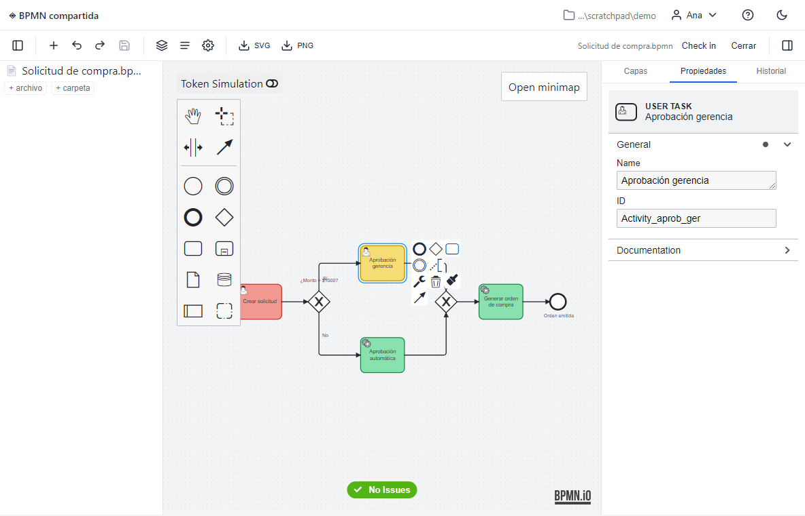
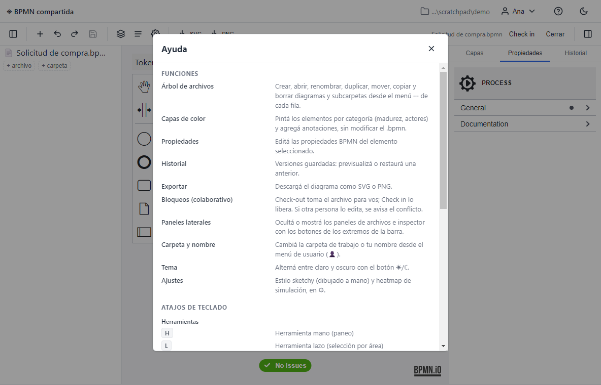

# BPMN compartida

Editor de diagramas **BPMN 2.0** para equipos que trabajan sobre una **carpeta
compartida** (Google Drive, OneDrive, Dropbox, Syncthing, red local…). Sin
servidor y sin base de datos: cada diagrama es un archivo `.bpmn` en una carpeta
sincronizada, y la colaboración se resuelve con **bloqueos por archivo**
(check-out / check-in) e **historial de versiones** local. Se distribuye como
**`.exe` portable de Windows** (Electron) y también corre en el navegador.


> 📘 **[Manual de uso completo →](docs/MANUAL.md)** — guía operativa de todas las
> funciones (guardado/publicar, sincronización, historial, documentación, ideas,
> colaboración con IA, capas, ajustes y actualización). También disponible **dentro
> de la app**, en el botón de **Ayuda**.

---

## ✨ Características

### Modelado BPMN completo
Editor basado en [bpmn-js](https://bpmn.io): paleta de elementos, panel de
propiedades, selector de color, minimapa, grilla, **validación en vivo**
(bpmnlint), **simulación de tokens**, modo de dibujo *sketchy* (a mano alzada) y
mapa de calor. Exportá a **SVG** o **PNG**.



### Capas de color (sin tocar el `.bpmn`)
Pintá los elementos por **categoría** (p. ej. madurez de automatización,
actores) y agregá anotaciones. Los colores se guardan en un *sidecar*
`<diagrama>.layers.json`, así que **no modifican el archivo BPMN**: no generan
ruido en el control de versiones ni conflictos al colaborar.

### Colaboración basada en archivos
- **Bloqueos optimistas**: *Check-out* toma el archivo para vos
  (`<nombre>.bpmn.lock`); *Check-in* lo libera. Si otra persona lo edita, se
  avisa el conflicto y se ofrece *Steal*.
- **Historial de versiones**: cada guardado conserva revisiones en
  `.history/<nombre>/` (con poda automática), con previsualización y
  restauración.
- **Detección de cambios externos**: la app vigila los archivos; si llega una
  versión nueva recarga (si no tenés cambios) o muestra una barra de conflicto
  con **Ver diferencias** (overlay de colores + tecla `d` para alternar).
- Tolerante a la sincronización en la nube (reintentos ante bloqueos de
  Drive/OneDrive al escribir).

### Gestión de archivos integrada
Árbol de archivos con **subcarpetas**: crear, abrir, renombrar, duplicar, mover,
copiar y borrar diagramas y carpetas desde el menú de cada fila.

### Productividad
- **Atajos de teclado** para herramientas (mano, lazo, conexión, espacio…) y
  edición (deshacer/rehacer, copiar/pegar, borrar, zoom, buscar).
- **Paneles laterales colapsables** e independientes.
- **Tema claro / oscuro**.
- Página de **ayuda** integrada con todas las funciones y atajos.



---

## 🚀 Uso (versión portable de Windows)

1. Descargá y **descomprimí la carpeta completa** (`BPMN-compartida-portable`).
2. Ejecutá **`BPMN compartida.exe`** desde dentro de esa carpeta. La primera vez
   Windows SmartScreen puede advertir (app sin firmar) → *Más información* →
   *Ejecutar de todos modos*.
3. Elegí tu **carpeta de trabajo** (la carpeta sincronizada donde viven —o
   vivirán— los `.bpmn`) y escribí tu nombre. Se recuerda en el equipo.


> **Importante:** la app **no** es un único `.exe` suelto. Necesita todos los
> archivos de su carpeta (incluida `resources\app.asar`). Copiá/comprimí
> siempre la carpeta **entera**. Es portable: funciona desde cualquier ruta,
> siempre que esté completa y los archivos estén realmente en disco (cuidado con
> los *placeholders* "solo en línea" de Drive/OneDrive).

### Versión web
También corre en el navegador (Chrome/Edge, vía File System Access API):
`npm run build && npm run preview`. La primera vez: *Elegir carpeta* → carpeta
sincronizada → tu nombre (el permiso se recuerda y se re-pide con 1 click).

---

## 🛠️ Desarrollo

Requisitos: Node.js 18+.

```bash
npm install          # instalar dependencias
npm run dev          # servidor de desarrollo (Vite) en el navegador
npm test             # tests (Vitest)
npm run typecheck    # chequeo de tipos
npm run build        # build de producción (dist/)
npm run electron:dev # build + abrir en Electron
```

### Empaquetar el portable de Windows

```bash
npm run pack:win   # build + empaqueta en release/BPMN compartida-win32-x64/
```

Usa [`@electron/packager`](https://github.com/electron/packager) de forma
programática (ver [`scripts/pack.cjs`](scripts/pack.cjs)). El icono de la app
está en [`build/icon.svg`](build/icon.svg) → `build/icon.ico`. Para distribuir,
comprimí la carpeta resultante en un `.zip`.

> Alternativa: `npm run dist:win` / `npm run dist:win:installer` usan
> `electron-builder` (portable autoextraíble / instalador NSIS).

---

## 🏗️ Arquitectura

- **SPA en TypeScript + Vite**, sin framework de UI.
- **Abstracción de almacenamiento** (`fsClient`) sobre una interfaz tipo
  `FileSystemDirectoryHandle`, con dos *backends* intercambiables:
  - **Web**: File System Access API del navegador.
  - **Electron**: IPC contra el proceso principal, que es el **único dueño** de
    la carpeta autorizada (el *renderer* nunca elige rutas → defensa ante un
    `.bpmn` malicioso). Las escrituras son atómicas y tolerantes a bloqueos.
- Esta abstracción deja la puerta abierta a futuros *backends* (p. ej. plugin de
  Obsidian o servicio web remoto) sin tocar la UI.
- Cobertura de pruebas amplia con Vitest (happy-dom).

---

## 🤝 Probar la colaboración (dos equipos sobre la misma carpeta)

1. PC A: *Elegir carpeta*, nombre "Ana". PC B: misma carpeta, nombre "Beto".
2. A: *Nuevo diagrama* `demo.bpmn`, agrega una tarea, *Guardar*, *Check in*.
3. B: tras la sync, `demo.bpmn` aparece en la lista. Abrir → se ve la tarea.
4. A: abrir `demo.bpmn` (queda 🔒 para B). B ve "lo edita Ana" y el botón *Steal*.
5. A: editar y *Guardar*. B (con el archivo abierto y SIN cambios): se recarga solo.
6. Conflicto: A y B editan a la vez; el segundo en guardar ve la barra de
   conflicto → *Ver diferencias* (colores + tecla `d`), luego *Descartar* o
   *Conservar lo mío*.
7. Historial: varias guardadas → panel de historial → *Preview* y *Restore*.

---

## 🔄 Mantener bpmn-js actualizado

- **Local:** `npm run update:bpmn` sube bpmn-js + el ecosistema bpmn-io a la
  última versión y corre tests/typecheck/build como compuerta. Si falla, revisá
  con `git diff` y revertí con `git checkout -- package.json package-lock.json`.
- **En la app:** ⚙ → "Buscar actualización" muestra la versión de bpmn-js y si
  hay una nueva.
- **CI:** el repo trae `renovate.json` (auto-merge de patch/minor del ecosistema
  bpmn-io tras CI verde + cooldown; los major llegan como PR) y
  `.github/workflows/ci.yml`.

## 🚀 Actualización de la app y versiones

- Los cambios por versión se registran en **[CHANGELOG.md](CHANGELOG.md)**.
- Cada versión se publica como **GitHub Release** con el `.zip` portable adjunto.
- La app trae un **chequeo de actualización in-app**: compara su versión con el
  último Release (`APP_UPDATE_FEED_URL` en `electron/main.cjs`) y muestra un
  banner "Versión X disponible — Descargar". Requiere que el repositorio sea
  **público** (se consulta sin autenticación); mientras es privado el chequeo es
  un no-op silencioso.

---

## ✅ Validación de flujo (bpmnlint)

El editor valida el diagrama con `bpmnlint:recommended` (marcadores sobre los
elementos + badge de errores/warnings, activo por defecto). Las reglas viven en
`.bpmnlintrc`; si las cambiás, regenerá la config empaquetada:

```bash
npm run lint:pack   # regenera src/linting/bpmnlintConfig.js (commiteá el resultado)
```

---

## 📝 Licencia y créditos

Código bajo licencia **[MIT](LICENSE)**.

Construido sobre el *toolkit* de **[bpmn.io](https://bpmn.io)** (bpmn-js y
librerías relacionadas) de Camunda Services GmbH. Conforme a la licencia de
bpmn.io, la marca de agua **"Powered by bpmn.io"** que aparece en los diagramas
se mantiene visible y no se elimina.
