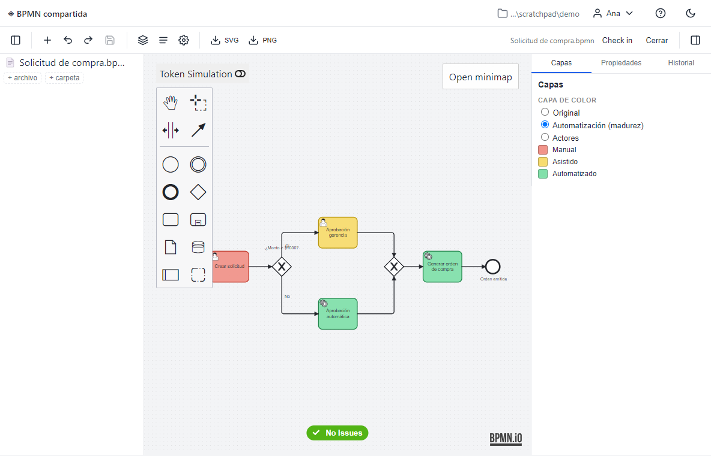
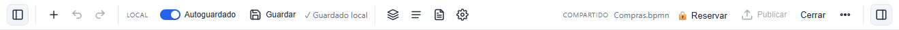
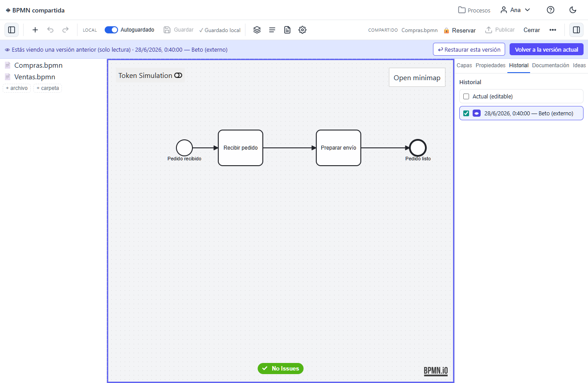
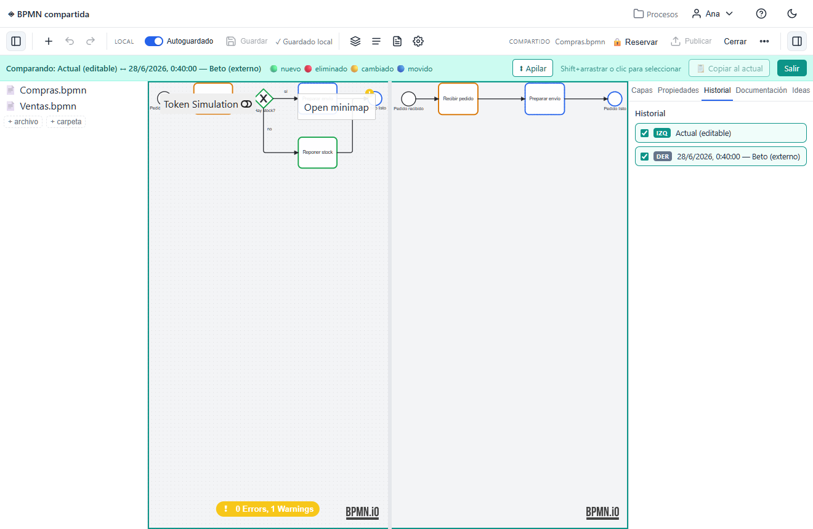
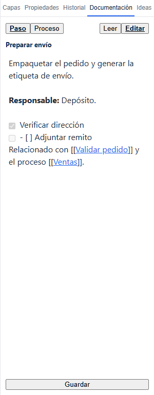
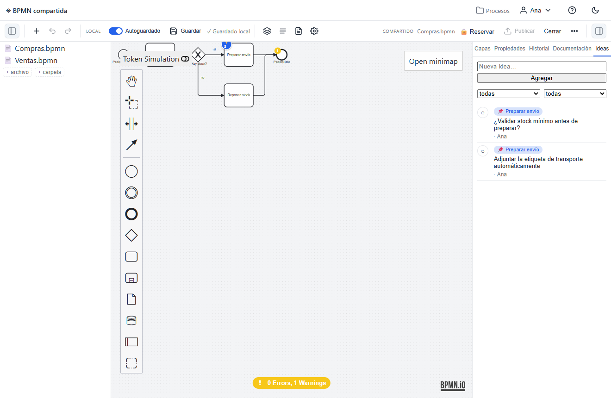
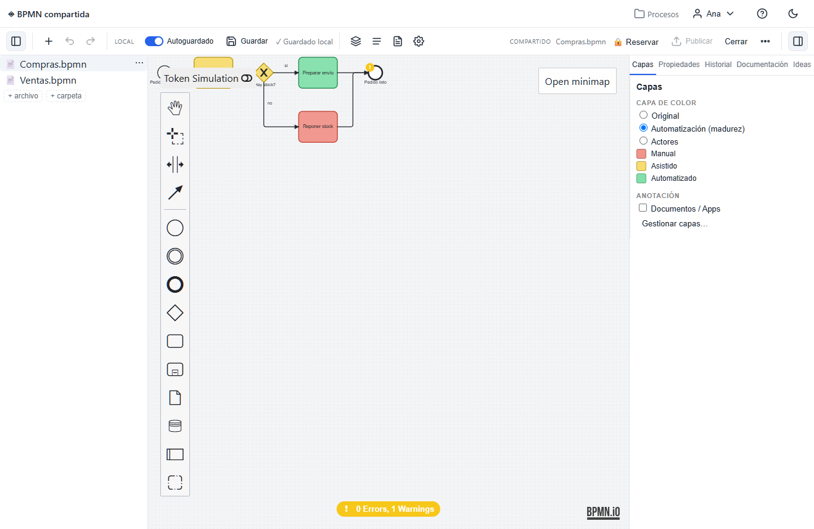
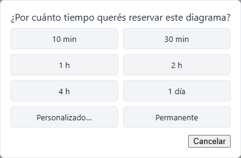
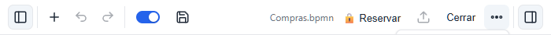
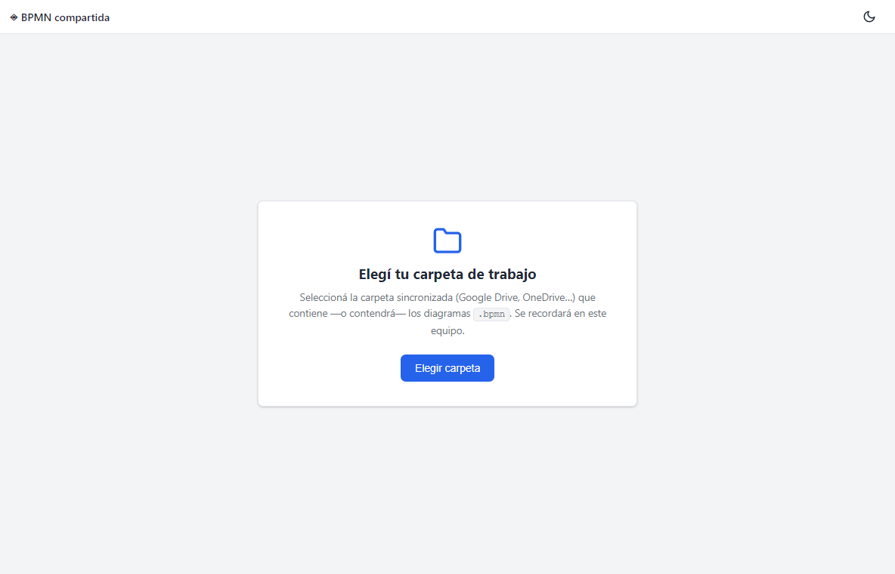

# BPMN compartida

Editor de diagramas **BPMN 2.0** para equipos que trabajan sobre una **carpeta
compartida** (Google Drive, OneDrive, Dropbox, Syncthing, red local…). Sin
servidor y sin base de datos: cada diagrama es un archivo `.bpmn` en una carpeta
sincronizada. La colaboración usa un modelo **optimista Borrador → Publicar**:
editás en un **borrador privado** y **Publicás** cuando querés compartir; el
historial, la documentación, las ideas y hasta los agentes de IA conviven en
archivos de texto junto a cada diagrama. Se distribuye como **`.exe` portable de
Windows** (Electron) y también corre en el navegador.



> 📘 **[Manual de uso completo →](docs/MANUAL.md)** — guía operativa con capturas y
> **casos de uso**: guardado/publicar, sincronización, historial, documentación,
> ideas, colaboración con IA, capas, ajustes y actualización. También disponible
> **dentro de la app**, en el botón de **Ayuda** (índice navegable).

---

## ✨ Características

### Modelado BPMN completo
Editor basado en [bpmn-js](https://bpmn.io): paleta de elementos, panel de
propiedades, selector de color, minimapa, grilla, **validación en vivo**
(bpmnlint), **simulación de tokens**, modo de dibujo *sketchy* (a mano alzada) y
mapa de calor. Exportá a **SVG** o **PNG**.

### Mapas maestros y subprocesos
Modelá procesos en capas: una **Call Activity** vincula un elemento a **otro
`.bpmn`** (su subproceso). Un mapa con vínculos es un **maestro** (badge 🗺).
**Doble-clic** en un elemento vinculado abre su subproceso **abajo, en un split
editable y redimensionable**, sin salir del maestro; cuando no hay ningún
subproceso abierto, el mapa ocupa **toda la pantalla**. En el árbol de archivos
los subprocesos aparecen **indentados bajo su maestro** (colapsables), y uno
compartido por varios maestros se muestra **bajo cada uno**. Incluye un perfil
BPMN propio y un **contrato de subprocesos** con eventos "viene de / va a".

### Guardado local y publicación (Borrador → Publicar)
Editar **nunca requiere pedir permiso ni bloquear**. Cada cambio se guarda en un
**borrador privado en tu máquina** (autoguardado con interruptor on/off + botón
**Guardar** manual, e indicador *✓ Guardado local / ● Sin guardar*). Cuando está
listo, **Publicar** (`Ctrl+S`) comparte con el equipo y crea una versión en el
historial. La barra separa lo **Local** de lo **Compartido**.



### Historial: previsualizar, comparar y rescatar
Cada publicación queda como versión en `.history/<nombre>/` (con **poda
automática**). El panel Historial usa **casillas** como selector: 1 marcada →
**previsualizás** (solo lectura, marco índigo); 2 marcadas → **comparás** en un
split sincronizado con diff a color (🟢 nuevo · 🔴 eliminado · 🟡 cambiado ·
🔵 movido). Podés **Restaurar** una versión a tu borrador, o **copiar elementos
sueltos** de una versión histórica a la actual (clic / **Shift+arrastre**,
conservando el *drag-hand*). Todo es **deshacible** con `Ctrl+Z`.




### Documentación de procesos
Cada diagrama tiene una carpeta hermana `<diagrama>.docs/` con documentación en
**Markdown**: una página del proceso y una nota por paso, con **wikilinks**
`[[proceso#elemento]]`, imágenes pegadas y un índice autogenerado. El botón
**Manual** arma un documento completo del proceso para **imprimir** o **exportar
HTML** autocontenido.



### Fuentes (documentos de respaldo)
Anexá los **documentos fuente** de un proceso o de una etapa (PDFs, planillas,
capturas, enlaces…) en un *sidecar* `<diagrama>.fuentes/`, con estados
**pendiente / procesada**. Quedan a mano en la pestaña **Fuentes** del panel, sin
tocar el `.bpmn`.

### Datos y herramientas
Registrá qué **datos** y qué **herramientas o sistemas** usa cada elemento del
proceso (texto libre con sugerencias de la propia carpeta), con **badges** sobre
el canvas y un ancla estándar. Se guarda en el *sidecar* `<diagrama>.datos.json`.

### Ideas y mejoras (con colaboración de IA)
Capturá **ideas** ancladas a cada elemento, en hilos con descripción, comentarios
y **estados** (pendiente / haciendo / pausado / hecho / rechazado). Badges 💡
clicables sobre el canvas, filtros, y **promoción de idea a *mejora*** vinculada.
Como todo es Markdown en la carpeta, **agentes de IA externos** (p. ej. Claude
Code sobre la misma carpeta) pueden leer y proponer cambios; se firman como autor
`IA` (🤖) siguiendo el protocolo `AGENTS.md`. **No hay API de LLM integrada**: es
colaboración basada en archivos.



### Agentes de IA (lanzador de escritorio)
Además de la colaboración por archivos, la app de escritorio trae un menú
**IA (✨)** para **lanzar agentes** (p. ej. Claude Code) en una **terminal
externa** sobre la carpeta del proyecto, con **presets** editables. Las
**instrucciones personales** para la IA y el visor del **`AGENTS.md`** generado
viven en **Configuraciones → IA**. Sigue sin haber API de LLM embebida: la app
solo abre la terminal con el comando del agente.

### Capas de color (sin tocar el `.bpmn`)
Pintá los elementos por **categoría** (p. ej. madurez de automatización, actores)
y agregá anotaciones. Los colores se guardan en un *sidecar*
`<diagrama>.layers.json`, así que **no modifican el archivo BPMN**: no generan
ruido en el control de versiones ni conflictos al colaborar. Guardá conjuntos de
capas como **plantillas** reutilizables.



### Coordinación de equipo y sincronización
- **Reserva** advisory (un aviso, no un bloqueo): "estoy trabajando en esto hasta
  tal hora", con duración elegible y expiración por inactividad. Si otra persona
  reservó, podés **solicitar turno**.
- **Detección de cambios externos**: si llega una versión nueva y no tenés
  cambios, se recarga sola; si hay conflicto al Publicar, aparece una barra con
  **Ver diferencias** (colores + tecla `d` para alternar), **Descartar** o
  **Conservar lo mío**.
- Detecta y avisa los **archivos en conflicto** que crea el cliente de sync
  (`proceso (1).bpmn`, `.sync-conflict-…`, etc.).



### Productividad
- **Auto-organizar**: re-acomoda el diagrama con un layout automático **horizontal**
  que **respeta swimlanes y fases** y rutea los conectores ortogonalmente
  minimizando cruces. Anda en el editor y en el **mapa maestro**, es **deshacible**
  y conserva colores. Incluye **"Reorganizar solo la selección"**.
- **Gestión de archivos** con subcarpetas: crear, abrir, renombrar, duplicar,
  mover, copiar y borrar desde el menú **⋯** de cada fila.
- **Atajos de teclado** para herramientas y edición; **deshacer/rehacer** robusto
  (incluye restaurar y copiar del historial).
- **Barra responsive**: en ventanas chicas colapsa a iconos y pliega lo
  secundario en un menú **"⋯ Más"** (nunca salta a dos líneas).
- **Panel lateral con riel de iconos** siempre visible (Capas, Propiedades,
  Historial, Documentación, Fuentes, Datos, Ideas) que se abre y colapsa con un
  clic, y **panel de archivos** redimensionable.
- **Configuraciones** unificadas por secciones (Visualización, IA, Generales,
  Versión y actualizaciones), **tema claro / oscuro**, y **manual de uso**
  integrado en **Ayuda**.



---

## 🚀 Uso (versión portable de Windows)

1. Descargá el `.zip` de la última **[Release](https://github.com/gmmazza/bpmn-modeller-collab/releases/latest)**
   y **descomprimí la carpeta completa**.
2. Ejecutá **`BPMN compartida.exe`** desde dentro de esa carpeta. La primera vez
   Windows SmartScreen puede advertir (app sin firmar) → *Más información* →
   *Ejecutar de todos modos*.
3. Elegí tu **carpeta de trabajo** (la carpeta sincronizada donde viven —o
   vivirán— los `.bpmn`) y escribí tu nombre. Se recuerda en el equipo.



> **Importante:** la app **no** es un único `.exe` suelto. Necesita todos los
> archivos de su carpeta (incluida `resources\app.asar`). Copiá/comprimí
> siempre la carpeta **entera**. Es portable: funciona desde cualquier ruta,
> siempre que esté completa y los archivos estén realmente en disco (cuidado con
> los *placeholders* "solo en línea" de Drive/OneDrive).

### Versión web
También corre en el navegador (Chrome/Edge, vía File System Access API):
`npm run build && npm run preview`. La primera vez: *Elegir carpeta* → carpeta
sincronizada → tu nombre (el permiso se recuerda y se re-pide con 1 click).

---

## 🛠️ Desarrollo

Requisitos: Node.js 18+.

```bash
npm install          # instalar dependencias
npm run dev          # servidor de desarrollo (Vite) en el navegador
npm test             # tests (Vitest)
npm run typecheck    # chequeo de tipos
npm run build        # build de producción (dist/)
npm run electron:dev # build + abrir en Electron
```

### Empaquetar el portable de Windows

```bash
npm run pack:win   # build + empaqueta en release/BPMN compartida-win32-x64/
```

Usa [`@electron/packager`](https://github.com/electron/packager) de forma
programática (ver [`scripts/pack.cjs`](scripts/pack.cjs)). El icono de la app
está en [`build/icon.svg`](build/icon.svg) → `build/icon.ico`. Para distribuir,
comprimí la carpeta resultante en un `.zip`.

> Alternativa: `npm run dist:win` / `npm run dist:win:installer` usan
> `electron-builder` (portable autoextraíble / instalador NSIS).

---

## 🏗️ Arquitectura

- **SPA en TypeScript + Vite**, sin framework de UI.
- **Abstracción de almacenamiento** (`fsClient`) sobre una interfaz tipo
  `FileSystemDirectoryHandle`, con dos *backends* intercambiables:
  - **Web**: File System Access API del navegador.
  - **Electron**: IPC contra el proceso principal, que es el **único dueño** de
    la carpeta autorizada (el *renderer* nunca elige rutas → defensa ante un
    `.bpmn` malicioso). Las escrituras son atómicas y tolerantes a bloqueos.
- El **borrador privado** vive por máquina (localStorage); solo **Publicar**
  escribe en la carpeta compartida. La documentación, ideas y capas son
  *sidecars* de texto junto al `.bpmn`.
- Cobertura de pruebas amplia con Vitest (happy-dom).

---

## 🤝 Probar la colaboración (dos personas sobre la misma carpeta)

1. PC A: *Elegir carpeta*, nombre "Ana". PC B: misma carpeta, nombre "Beto".
2. A: *Nuevo diagrama* `demo.bpmn`, agrega una tarea, **Publicar**.
3. B: tras la sync, `demo.bpmn` aparece en la lista. Abrir → se ve la tarea.
4. A: **Reservar** `demo.bpmn` (aviso al equipo). B ve "Reservado por Ana" y puede
   **Solicitar turno** — sin quedar bloqueado.
5. A: editar y **Publicar**. B (con el archivo abierto y SIN cambios): se recarga solo.
6. Conflicto: A y B editan a la vez; el segundo en publicar ve la barra de
   conflicto → *Ver diferencias* (colores + tecla `d`), luego *Descartar* o
   *Conservar lo mío*.
7. Historial: varias publicaciones → panel Historial → **previsualizar**,
   **comparar** y **restaurar**.

---

## 🔄 Mantener bpmn-js actualizado

- **Local:** `npm run update:bpmn` sube bpmn-js + el ecosistema bpmn-io a la
  última versión y corre tests/typecheck/build como compuerta. Si falla, revisá
  con `git diff` y revertí con `git checkout -- package.json package-lock.json`.
- **En la app:** **Configuraciones → Versión y actualizaciones** muestra la
  versión de bpmn-js y si hay una nueva.
- **CI:** el repo trae `renovate.json` (auto-merge de patch/minor del ecosistema
  bpmn-io tras CI verde + cooldown; los major llegan como PR) y
  `.github/workflows/ci.yml`.

## 🚀 Actualización de la app y versiones

- Los cambios por versión se registran en **[CHANGELOG.md](CHANGELOG.md)**.
- Cada versión se publica como **GitHub Release** con el `.zip` portable adjunto.
- La app trae un **chequeo de actualización in-app** (**Configuraciones →
  Versión y actualizaciones**): compara su versión con el último Release
  (`APP_UPDATE_FEED_URL` en `electron/main.cjs`) y muestra un banner "Versión X
  disponible — Descargar", con **actualización en el lugar** en el portable de
  Windows. Requiere que el repositorio sea
  **público** (se consulta sin autenticación); mientras es privado el chequeo es
  un no-op silencioso.

---

## ✅ Validación de flujo (bpmnlint)

El editor valida el diagrama con `bpmnlint:recommended` (marcadores sobre los
elementos + badge de errores/warnings, activo por defecto). Las reglas viven en
`.bpmnlintrc`; si las cambiás, regenerá la config empaquetada:

```bash
npm run lint:pack   # regenera src/linting/bpmnlintConfig.js (commiteá el resultado)
```

---

## 📝 Licencia y créditos

Código bajo licencia **[MIT](LICENSE)**.

Construido sobre el *toolkit* de **[bpmn.io](https://bpmn.io)** (bpmn-js y
librerías relacionadas) de Camunda Services GmbH. Conforme a la licencia de
bpmn.io, la marca de agua **"Powered by bpmn.io"** que aparece en los diagramas
se mantiene visible y no se elimina.
