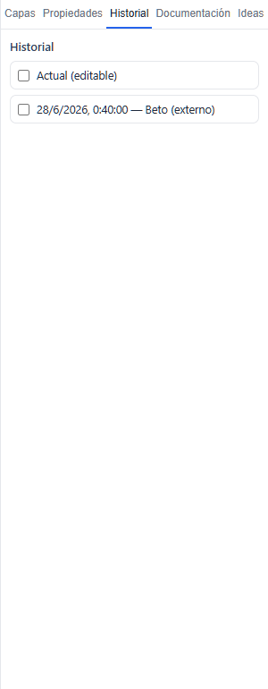
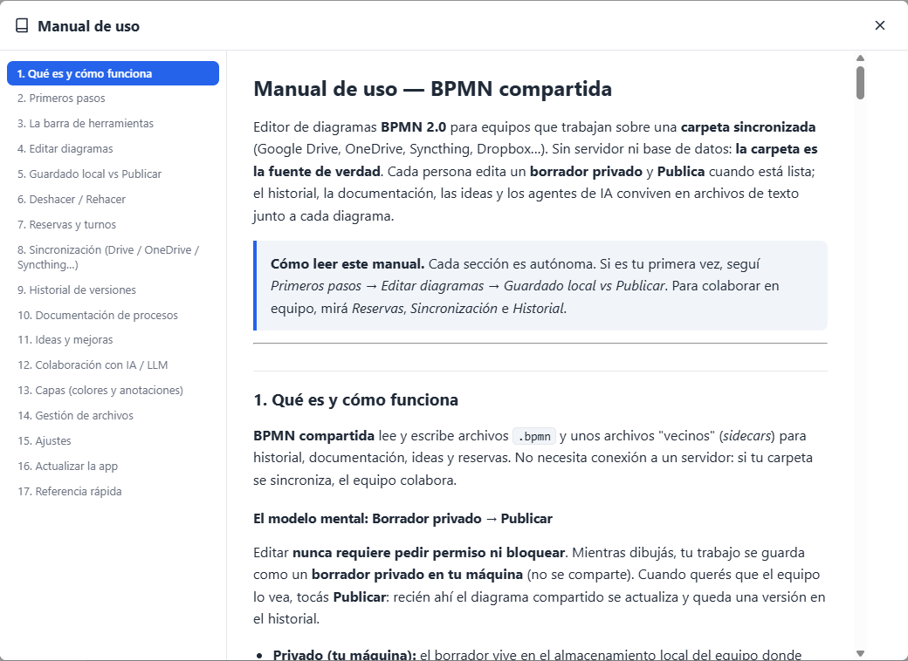

# Manual de uso — BPMN compartida

Editor de diagramas **BPMN 2.0** para equipos que trabajan sobre una **carpeta sincronizada** (Google Drive, OneDrive, Syncthing, Dropbox…). Sin servidor ni base de datos: **la carpeta es la fuente de verdad**. Cada persona edita un **borrador privado** y **Publica** cuando está lista; el historial, la documentación, las ideas y los agentes de IA conviven en archivos de texto junto a cada diagrama.

> **Cómo leer este manual.** Cada sección es autónoma. Si es tu primera vez, seguí *Primeros pasos* → *Editar diagramas* → *Guardado local vs Publicar*. Para colaborar en equipo, mirá *Reservas*, *Sincronización* e *Historial*.


---

## 1. Qué es y cómo funciona

**BPMN compartida** lee y escribe archivos `.bpmn` y unos archivos "vecinos" (*sidecars*) para historial, documentación, ideas y reservas. No necesita conexión a un servidor: si tu carpeta se sincroniza, el equipo colabora.

### El modelo mental: Borrador privado → Publicar

Editar **nunca requiere pedir permiso ni bloquear**. Mientras dibujás, tu trabajo se guarda como un **borrador privado en tu máquina** (no se comparte). Cuando querés que el equipo lo vea, tocás **Publicar**: recién ahí el diagrama compartido se actualiza y queda una versión en el historial.

- **Privado (tu máquina):** el borrador vive en el almacenamiento local del equipo donde estás. No se sincroniza, no se filtra al equipo. No perdés trabajo por cerrar la app.
- **Compartido (la carpeta):** el `.bpmn`, su documentación, ideas e historial se sincronizan. Publicar es lo único que expone tu cambio al resto.

> **Idea central.** La **Reserva** (candado) es solo un aviso cortés — "estoy trabajando en esto" — no un bloqueo. Podés editar y publicar aunque otra persona tenga reserva; la app te ayuda a coordinarte, no te frena.

### Quiénes participan: personas y agentes de IA

Además de las personas del equipo, **agentes de IA externos** (por ejemplo Claude Code corriendo sobre la misma carpeta) pueden leer y proponer cambios editando los archivos de texto —sobre todo las ideas y la documentación—. La app los reconoce como autor `IA` y los marca con 🤖. Ver **Colaboración con IA**.

---

## 2. Primeros pasos

1. **Elegí tu carpeta de trabajo.** Al abrir por primera vez, tocá **"Elegir carpeta"** y seleccioná la carpeta sincronizada (Drive/OneDrive) que contiene —o va a contener— los diagramas `.bpmn`. Queda recordada en ese equipo.
2. **Poné tu nombre.** Arriba a la derecha, el botón con tu nombre abre un menú: **"Cambiar nombre"**. Ese nombre firma tus publicaciones, reservas, ideas y comentarios.
3. **Elegí el tema.** El botón ☀️/🌙 del encabezado alterna claro/oscuro.
4. **Abrí o creá un diagrama.** En el panel de archivos (izquierda), tocá un `.bpmn` para abrirlo, o usá **"+ archivo"** para crear uno nuevo.

> **Consejo.** Corré la app desde *dentro* de la carpeta sincronizada del proyecto. Todo lo demás (historial, docs, ideas) se crea automáticamente al lado de cada diagrama.

---

## 3. La barra de herramientas

Está organizada en dos grupos lógicos, para separar *lo tuyo* de *lo del equipo*:


- **Grupo "Local":** **Autoguardado** (interruptor on/off) · botón **Guardar** (guarda tu borrador ahora) · indicador de estado *✓ Guardado local / ● Sin guardar*.
- **Grupo "Compartido":** estado de reserva del archivo · botón de reserva (**Reservar / Liberar / Solicitar turno**) · **Publicar** · **Cerrar**.

A la izquierda están las herramientas de edición (Nuevo, Deshacer, Rehacer); en el centro, las pestañas del panel lateral (Capas, Propiedades, Documentación) y Ajustes; y Exportar SVG/PNG y Manual.

> **Barra responsive.** Si la ventana es angosta, las etiquetas se ocultan (quedan iconos) y los grupos secundarios (Exportar, pestañas) se pliegan en un menú **"⋯ Más"**. La barra **nunca** salta a dos líneas. Al agrandar, todo vuelve a su lugar.


---

## 4. Editar diagramas

El lienzo es un editor BPMN completo (bpmn-js): paleta a la izquierda, *context pad* al seleccionar un elemento, minimapa, panel de propiedades y validación (lint) en vivo. Herramientas por teclado nativas: mano (pan), lazo, espacio, conexión y crear elementos.

- **Crear:** arrastrá desde la paleta o usá el context pad de un elemento.
- **Propiedades:** pestaña **Propiedades** del panel lateral para nombre, tipo y atributos.
- **Exportar:** los botones **SVG** y **PNG** generan una imagen del diagrama; **Manual** arma un documento del proceso (ver *Documentación*).
- **Validación:** el linter marca sobre el lienzo los elementos con problemas (eventos sin conectar, etc.). Está siempre activo.

> **Navegar entre procesos.** Doble-clic en un **Call Activity** (subproceso llamado) abre el proceso referenciado. Los eventos de mensaje/señal saltan a su contraparte. También podés enlazar con *wikilinks* `[[proceso#elemento]]` desde la documentación.

---

## 5. Guardado local vs Publicar

Son dos acciones distintas y complementarias.

| Acción | Qué hace | Cómo se dispara | Alcance |
| --- | --- | --- | --- |
| **Guardar (borrador)** | Persiste tu trabajo en tu máquina. No lo comparte. | Automático (si el Autoguardado está ON) o botón **Guardar** | Privado |
| **Publicar** | Escribe el diagrama compartido, crea una versión en el historial y borra el borrador (ya está publicado). | Botón **Publicar** o `Ctrl+S` | Equipo |

### Autoguardado y guardado manual

Con **Autoguardado ON** (por defecto), cada cambio se guarda al borrador solo, con un pequeño retardo. Con **OFF**, no se autoguarda: usás el botón **Guardar** cuando querés. El indicador del grupo Local te dice el estado: *"● Sin guardar"* (cambios pendientes) o *"✓ Guardado local"*.

> **Indicadores.** Un chip *"✏️ Borrador sin publicar"* y un punto en el botón Publicar avisan que tenés cambios locales que el equipo todavía no ve. Al reabrir un archivo con borrador pendiente, la app te pregunta si querés **"Seguir con mi borrador"**.

### Al publicar: detección de conflictos

Si el archivo compartido cambió por fuera desde que lo abriste, Publicar no pisa ciegamente: aparece la **barra de conflicto** (ver *Sincronización*) para que decidas. Sin conflicto, publica y muestra *"Publicado"*.

---

## 6. Deshacer / Rehacer

`Ctrl+Z` deshace y `Ctrl+Y` (o `Ctrl+Shift+Z`) rehace. Además de las ediciones normales del diagrama, el deshacer cubre dos operaciones "grandes" que traen contenido de otra versión:

- **Restaurar una versión del historial** — podés deshacer la restauración y volver a tu estado previo.
- **Copiar elementos desde una versión histórica** (en modo comparación) — el pegado es un paso deshacible.

En esos casos, `Ctrl+Z` primero deshace tus ediciones finas y, cuando se agotan, revierte la operación grande. Verás *"Se deshizo la restauración"* / *"Se rehizo la restauración"*.

> **Ojo.** Cambiar de archivo, cambiar el tema de dibujo (sketchy/heatmap) o una recarga externa **reinician** el historial de deshacer del diagrama: son contextos nuevos. Publicá o guardá tu borrador antes de esas acciones.

---

## 7. Reservas y turnos

La **Reserva** es un candado *advisory* (aviso): le dice al equipo "estoy trabajando en este diagrama hasta tal hora". No impide que otros editen o publiquen.


1. **Reservar.** Botón **"🔒 Reservar"** del grupo Compartido → elegís duración: *10 min · 30 min · 1 h · 2 h · 4 h · 1 día · Personalizado… · Permanente*. El equipo ve un chip con tu nombre y la hora de fin.
2. **Liberar.** Botón **"🔓 Liberar reserva"** cuando terminaste. Tu borrador queda intacto.
3. **Solicitar turno.** Si otra persona reservó, tu botón dice **"🔔 Solicitar turno"**: le avisás que querés editar/publicar (*"Aviso enviado — te aviso cuando libere la reserva"*). Cuando libera, te llega *"✅ … quedó libre — ya podés editar/publicar"*.

> **Detalles.** Las reservas **vencen** solas al llegar su hora, y una reserva propia se libera **por inactividad** (*"Reserva liberada por inactividad — tu borrador sigue intacto"*). Todo esto usa archivos vecinos: `<archivo>.bpmn.lock` (la reserva) y `<archivo>.bpmn.req` (el pedido de turno).

---

## 8. Sincronización (Drive / OneDrive / Syncthing…)

La app no sincroniza por sí misma: confía en tu cliente de sync. Cada **7 segundos** revisa la carpeta para detectar cambios externos y refrescar la lista de archivos.

### Conflictos del cliente de sync

Cuando dos personas guardan a la vez, el cliente de sync a veces crea copias duplicadas (`proceso (1).bpmn`, `proceso.sync-conflict-…`, `-DESKTOP-…`, `-conflicto`…). La app los detecta y los saca de la lista normal, mostrando arriba una barra: *"⚠ Archivos en conflicto de sincronización (resolvé a mano)"* con sus nombres, para que decidas cuál conservar.

### Conflicto de publicación

Si vas a Publicar y el diagrama compartido ya no es el que abriste, aparece la **barra de conflicto** (*"Este diagrama cambió por fuera"*) con tres opciones:

| Opción | Efecto |
| --- | --- |
| **Ver diferencias** | Abre una vista de diff (dos versiones a color). Con la tecla `d` alternás entre "tu versión" y "la externa". |
| **Descartar lo mío y recargar** | Tira tu borrador y carga la versión externa. |
| **Conservar lo mío** | Publica tu versión igual, pisando la externa. |

> **Recarga silenciosa.** Si el archivo cambió por fuera y vos **no** tenías cambios sin publicar, la app se actualiza sola (*"Recargado — actualizado externamente"*), sin molestarte.

---

## 9. Historial de versiones

Cada **Publicar** guarda una versión. El historial vive en `.history/<archivo>/`, un archivo por revisión, nombrado con su fecha y autor. Abrí la pestaña **Historial** del panel lateral para verlo.



### Las casillas SON el control

Cada versión tiene una casilla. Lo que marcás decide el modo:

| Marcás | Modo | Qué pasa |
| --- | --- | --- |
| 1 versión | **Vista previa** 👁 | El lienzo muestra esa versión en solo-lectura (marco índigo). Podés desde ahí **Restaurar** o **Volver**. |
| 2 versiones (o Actual + 1) | **Comparación** | Dos paneles lado a lado con el diff coloreado. Badges *izq/der* (o *arriba/abajo*). |
| 0 / solo "Actual" | Trabajo | Vuelve a tu versión editable. |

**Leyenda del diff:** 🟢 nuevo · 🔴 eliminado · 🟡 cambiado · 🔵 movido. Los dos paneles (pan/zoom) están sincronizados; podés cambiar la orientación (lado a lado ↔ apilado).


### Restaurar una versión vieja

En vista previa, **"↩ Restaurar esta versión"** trae ese contenido a tu borrador editable (después Publicás para compartirlo). Es deshacible con `Ctrl+Z`.

### Copiar elementos del pasado

En **comparación** con "Actual" a la izquierda, podés tomar elementos de la versión histórica (derecha) y traerlos a tu diagrama actual:

- **Clic** sobre un elemento lo selecciona; **Shift+arrastrar** dibuja un recuadro para varios; el arrastre normal **panea** (sigue estando la mano).
- Con algo seleccionado, **"📋 Copiar al actual (N)"** los pega en tu borrador. Sobrevive al salir de la comparación, habilita Publicar y es deshacible.

### Retención

El historial se poda solo con una política de decaimiento (más densidad en lo reciente, menos en lo viejo; tope ~150 versiones). Para que una versión **no se borre nunca**, marcala como "guardar siempre" (queda con sufijo `.keep`).

---

## 10. Documentación de procesos

Cada diagrama tiene una carpeta hermana `<archivo>.docs/` con su documentación en Markdown. Se abre desde la pestaña **Documentación** del panel lateral.

### Dos alcances, dos modos

- **Pestaña "Paso":** documenta el **elemento seleccionado** en el diagrama. Sin selección: *"Seleccioná un paso…"*. Con selección sin nota: **"Documentar este paso"**. Se guarda en `<elementId>.md`.
- **Pestaña "Proceso":** descripción general del proceso (dueño, alcance). Botón **"Crear página del proceso"**. Se guarda en `_proceso.md`.

El botón **Editar** abre un editor Markdown con vista en vivo; **Leer** muestra el render. **Guardar** persiste la nota.


### Enlaces vivos: wikilinks `[[…]]`

Dentro de las notas podés enlazar escribiendo `[[` (con autocompletado):

| Sintaxis | Salta a… |
| --- | --- |
| `[[proceso]]` | Abre ese diagrama. |
| `[[Nombre del paso]]` | Selecciona ese elemento en el diagrama actual. |
| `[[proceso#elemento]]` | Abre el proceso y selecciona el elemento. |
| `[[idea:ref]]` | Abre esa idea en el panel de Ideas. |

### Imágenes e índice

- **Imágenes:** pegá o arrastrá una imagen al editor y se inserta como ``, guardada en `<archivo>.docs/assets/`.
- **Índice:** `_index.md` es una tabla de todos los pasos, **regenerada automáticamente** (no la edites a mano).

### Manual del proceso

El botón **Manual** (de la barra) arma un documento con la descripción del proceso y cada paso en orden de flujo. Desde el modal podés **Imprimir** o **Exportar HTML** (archivo autocontenido, con las imágenes incrustadas).

---

## 11. Ideas y mejoras

Una **idea** es una anotación con hilo, anclada a un elemento del diagrama (o general): una sugerencia, un problema, una discusión. Las ideas **siempre están compartidas** (no tienen borrador) y se editan sin reservas. Pestaña **Ideas** del panel lateral.


### Ciclo de vida: cinco estados

| Estado | Significado | ¿Cuenta en el badge? |
| --- | --- | --- |
| ○ **pendiente** | Sin empezar. | Sí |
| ◑ **haciendo** | En progreso. | Sí |
| ⏸ **pausado** | En pausa (pide un motivo). | Sí |
| ● **hecho** | Completada. | No |
| ✕ **rechazado** | Descartada (pide un motivo). | No |

### Trabajar con ideas

1. **Crear.** Con la pestaña Ideas activa, seleccioná un elemento y escribí en *"Nueva idea para …"* → **Agregar** (o usá el popover "Nueva idea acá…" al clicar un elemento).
2. **Badges.** Los elementos con ideas activas muestran **💡 N** sobre el lienzo. Clic en el badge abre la idea.
3. **Comentar y cambiar estado.** En el hilo agregás comentarios, cambiás el estado (con motivo si es pausado/rechazado) y podés ver el **"Historial de estados"**.
4. **Promover a mejora.** El botón **"Promover a mejora"** convierte una idea en una **mejora** (propuesta concreta) con su propio ciclo *propuesta → aprobada → implementada*, enlazada a la idea de origen.

En disco: `<archivo>.docs/ideas/idea-N.md`, `…/mejoras/mejora-N.md` y un índice `_ideas.md` (autogenerado). Podés filtrar por estado y por alcance (ancladas / generales).

---

## 12. Colaboración con IA / LLM

> **Importante.** La app **no integra ningún modelo ni API de LLM** y no tiene un chat interno. La "función de IA" es un **protocolo de colaboración basado en archivos**: agentes externos (Claude Code, u otros que corran sobre la misma carpeta) leen y proponen cambios editando los `.md` de ideas y documentación. La app los detecta y reconcilia.

### El contrato: AGENTS.md

La primera vez, la app deja un `AGENTS.md` en la raíz de la carpeta. Es la guía para cualquier agente: describe las convenciones de archivos (docs, ideas, mejoras) y cómo firmar sus aportes. Un agente debe:

- **Firmar como `IA`** (o el nombre configurado) en comentarios: `- IA, YYYY-MM-DD: <texto>`.
- **Registrar cambios de estado** tanto en el frontmatter (`estado:`) como en una viñeta `- IA, fecha: [estado] <motivo>`.
- **Preferir proponer** vía ideas/comentarios antes que editar el `.bpmn` directamente; y si alguien reservó, escribir un `<archivo>.bpmn.req` para pedir turno.

### Identidad y reconciliación

Los aportes de autores IA se muestran con **🤖** en los hilos. Podés declarar qué nombres son "IA" (además del default `IA`) con la clave `bpmn-compartida.aiAuthors` en el almacenamiento local (por ejemplo `Claude, Cowork`). Si un agente cambia el estado de una idea en el archivo sin dejar la viñeta de log, la app la agrega sola al recargar, para mantener el hilo coherente.

> **En la práctica.** Flujo típico: una persona crea una idea → un agente de IA la analiza y comenta en el archivo → la persona la promueve a mejora y la implementa en el diagrama → Publica. Todo queda trazado en texto, versionado por la carpeta.

---

## 13. Capas (colores y anotaciones)

Las **capas** son dimensiones de anotación visual sobre el diagrama: te dejan pintar los elementos según una clasificación, sin tocar el modelo BPMN. Pestaña **Capas** del panel lateral. Se guardan en `<archivo>.layers.json`.

Hay dos tipos de dimensión: **Color** (categorías con color, p. ej. nivel de automatización o actor responsable) y **Anotación** (marcas sin color). La app trae ejemplos por defecto como *"Automatización (madurez)"* —manual/asistido/automatizado— y *"Actores"*.


- **Asignar:** seleccioná un elemento y elegí su categoría en el panel; se pinta al instante.
- **Gestionar:** el modal de capas permite agregar/renombrar/borrar dimensiones y categorías, elegir colores y reordenar.
- **Plantillas:** guardá un conjunto de capas como plantilla reutilizable (`.layer-templates/`) para aplicarlo a otros diagramas.

> **Nota técnica.** Los colores son marcadores del editor (no atributos del XML). Se re-aplican al recargar el diagrama; por eso conviven bien con historial, preview y comparación.

---

## 14. Gestión de archivos

El panel izquierdo muestra el árbol de la carpeta. Crear con **"+ archivo"** / **"+ carpeta"**; el menú **"⋯"** de cada ítem ofrece Abrir, Renombrar, Duplicar / Copiar a…, Mover a… y Borrar (las carpetas: Nuevo diagrama aquí, Nueva subcarpeta, Renombrar, Mover, Borrar).

- Los nombres no pueden llevar `/` ni `\`; la extensión `.bpmn` se agrega sola.
- Mover/copiar/borrar arrastra consigo los sidecars del diagrama (documentación, historial, capas, reserva).
- Borrar pide confirmación (*"No se puede deshacer"*).

Los archivos "vecinos" (historial, docs, reservas, capas) están ocultos del árbol para no distraer. Anatomía en disco de un diagrama:

```
<carpeta sincronizada>/
├─ proceso.bpmn                 # el diagrama
├─ proceso.bpmn.lock            # reserva (aviso), si hay
├─ proceso.bpmn.req             # pedido de turno, si hay
├─ proceso.layers.json          # capas / colores
├─ proceso.docs/                # documentación
│   ├─ _proceso.md              # descripción general
│   ├─ _index.md                # índice (auto)
│   ├─ <elementId>.md           # nota por paso
│   ├─ _ideas.md                # índice de ideas (auto)
│   ├─ ideas/ idea-1.md …       # una idea por archivo
│   ├─ mejoras/ mejora-1.md …   # mejoras
│   └─ assets/ imagen-1.png …   # imágenes pegadas
├─ .history/proceso/            # versiones publicadas
│   └─ <fecha>~<autor>.bpmn
└─ AGENTS.md                    # protocolo para agentes IA
```

---

## 15. Ajustes

El engranaje **Ajustes** abre un popover con opciones de visualización; otras preferencias viven en el encabezado y la barra.

| Opción | Dónde | Qué hace |
| --- | --- | --- |
| **Estilo sketchy** (dibujado a mano) | Ajustes | Renderiza el diagrama con trazo tipo boceto. Recrea el editor (guarda antes). |
| **Heatmap de simulación** (beta) | Ajustes | Activa la simulación de tokens con mapa de calor sobre el flujo. |
| **Versión de bpmn-js + "Buscar actualización"** | Ajustes | Muestra la versión del motor y verifica si hay una nueva. |
| **Autoguardado** | Barra · grupo Local | Interruptor on/off del guardado automático del borrador. |
| **Tema claro/oscuro** | Encabezado ☀️/🌙 | Alterna el tema visual. |
| **Tu nombre** | Encabezado · menú de usuario | "Cambiar nombre" — firma tus acciones. |
| **Carpeta de trabajo** | Encabezado · menú de usuario | "Cambiar carpeta" — apunta a otra carpeta sincronizada. |

> **Dónde se guardan.** Las preferencias (nombre, tema, ajustes de visualización, autoguardado) son **por máquina** (almacenamiento local). Cambiar de carpeta no las pierde.

---

## 16. Actualizar la app

Al iniciar, la app consulta las **Releases de GitHub** del proyecto. Si hay una versión nueva, aparece una barra: *"Versión X disponible"* con **Descargar** (abre la página de la release) y **Después** (oculta el aviso).

- **Build portable:** el ejecutable guarda su estado junto a sí mismo (podés llevarlo en un USB sin dejar rastros en el sistema).
- **Empaquetado (mantenimiento):** el `.exe` se genera con `npm run pack:win`; para subir el motor de diagramas, `npm run update:bpmn` y se regenera.

---

## 17. Casos de uso y flujos

Ejemplos concretos de principio a fin. Cada uno combina varias funciones; los números remiten a las secciones anteriores.

### Caso A — Editar y publicar un cambio (el día a día)

El flujo más común, trabajando solo/a sobre un proceso.

1. Abrí el diagrama desde el panel de archivos.
2. Editá en el lienzo (agregar/mover tareas, conectar). El **Autoguardado** va guardando tu **borrador privado**; el indicador dice *● Sin guardar* → *✓ Guardado local*. → §4, §5
3. Cuando esté listo, **Publicar** (`Ctrl+S`) → confirmás → *"Publicado"*. Queda una versión en el **Historial** y tu borrador se limpia. → §5, §9
4. ¿Te equivocaste? `Ctrl+Z` deshace; y si ya publicaste, entrás al **Historial** y **Restaurás** la versión anterior. → §6, §9

### Caso B — Coordinar cuando varias personas tocan el mismo proceso

Nadie queda bloqueado, pero se evita pisarse.

1. Antes de un cambio largo, **Reservá** el diagrama por el tiempo que estimes (*30 min*, *2 h*…). El equipo ve *"Reservado por vos"*. → §7
2. Si otra persona ya lo reservó, tu botón dice **"🔔 Solicitar turno"**: avisás y seguís en lo tuyo. Cuando libera, te llega *"✅ … quedó libre"*. → §7
3. Terminás → **Publicar** → **Liberar reserva**. (Si te distraés, la reserva **vence sola**; tu borrador queda intacto.) → §7

### Caso C — Resolver un conflicto de publicación

Dos personas editaron la misma versión y sincronizaron.

1. Al **Publicar**, aparece la barra *"Este diagrama cambió por fuera"*. → §8
2. Tocá **Ver diferencias** y usá la tecla `d` para alternar *tu versión* ↔ *la externa* y entender qué cambió. → §8
3. Decidí: **Conservar lo mío** (publica tu versión), **Descartar lo mío y recargar** (te quedás con la del equipo), o cancelar y fusionar a mano copiando lo que falte. → §8, §9

### Caso D — Rescatar algo de una versión anterior

Se borró un subproceso hace tres versiones y lo querés de vuelta — sin perder lo actual.

1. Pestaña **Historial** → marcá **"Actual"** + la **revisión** vieja (2 casillas) → entrás a **Comparación**. → §9
2. En el panel histórico (derecha): **clic** en el elemento a rescatar, o **Shift+arrastrar** para varios. El arrastre normal solo **panea**. → §9
3. **"📋 Copiar al actual"** → los elementos aparecen en tu borrador. **Salir** de la comparación → **Publicar**. `Ctrl+Z` deshace el pegado si te arrepentís. → §6, §9


### Caso E — Documentar el proceso y entregar un Manual

Dejar el proceso listo para que otro lo entienda.

1. Escribí la visión general en la pestaña **Documentación → Proceso**. → §10
2. Seleccioná cada paso clave y documentalo en **Documentación → Paso** (pegá capturas si ayuda; enlazá con `[[otro-proceso]]`). → §10
3. Botón **Manual** (barra) → revisás el documento armado con el proceso y todos los pasos en orden → **Exportar HTML** o **Imprimir** para compartir con quien no usa la app. → §10

### Caso F — Ciclo de mejora con ideas y un agente de IA

Del feedback disperso a un cambio implementado y trazable.

1. Alguien detecta algo: pestaña **Ideas**, selecciona el paso, escribe la idea → **Agregar**. Aparece el badge **💡** sobre el elemento. → §11
2. El equipo **comenta** en el hilo. Un **agente de IA** (que corre sobre la misma carpeta) lee el archivo de la idea, analiza y **comenta firmando como `IA`** (se muestra con 🤖). → §11, §12
3. Se decide avanzar: **cambiar estado** a *haciendo* → **Promover a mejora**. → §11
4. Se implementa el cambio en el diagrama y se **Publica**. La idea/mejora queda enlazada y versionada en la carpeta. → §5, §11

### Caso G — Clasificar el proceso con capas

Ver de un vistazo qué está automatizado y quién hace qué.

1. Pestaña **Capas** → activá la dimensión **"Automatización (madurez)"**. → §13
2. Seleccioná cada elemento y asignale una categoría (*Manual*, *Asistido*, *Automatizado*) con el desplegable **Asignar al elemento**. El diagrama se pinta al instante. → §13
3. Cambiá a la dimensión **"Actores"** para ver el mismo proceso por responsable. Guardá el conjunto como **plantilla** para reutilizarlo en otros diagramas. → §13


---

## 18. Referencia rápida

### Atajos de teclado

| Atajo | Acción |
| --- | --- |
| `Ctrl+S` | Publicar (compartir al equipo) |
| `Ctrl+Z` / `Ctrl+Y` | Deshacer / Rehacer (incluye restaurar y copiar del historial) |
| `Ctrl+C` / `Ctrl+V` / `Ctrl+X` | Copiar / pegar / cortar elementos (nativo del editor) |
| `Ctrl+D` | Duplicar la selección |
| `Ctrl+A` | Seleccionar todo |
| `Supr` / `Backspace` | Borrar la selección |
| `Shift+arrastrar` | Selección por recuadro en el panel histórico (comparación) |
| `d` | En la vista de diferencias: alterna "mi versión" ↔ "versión externa" |
| `H` · `L` · `S` · `C` · `E` · `R` | Herramientas del editor (mano, lazo, espacio, conectar, editar etiqueta, reemplazar) |

### Convenciones de archivos

| Archivo / carpeta | Para qué |
| --- | --- |
| `<nombre>.bpmn` | El diagrama (BPMN 2.0). |
| `<nombre>.bpmn.lock` | Reserva advisory (JSON): quién y hasta cuándo. |
| `<nombre>.bpmn.req` | Pedido de turno (JSON). |
| `<nombre>.layers.json` | Capas y colores. |
| `<nombre>.docs/` | Documentación, ideas, mejoras, imágenes. |
| `.history/<nombre>/` | Versiones publicadas (una por revisión). |
| `AGENTS.md` | Protocolo de colaboración para agentes de IA. |

### Glosario

| Término | Definición |
| --- | --- |
| **Borrador** | Tu trabajo sin publicar, privado y por máquina. |
| **Publicar** | Compartir el diagrama con el equipo y crear una versión en el historial. |
| **Reserva** | Aviso "estoy trabajando en esto", no un bloqueo. |
| **Vista previa / Comparación** | Ver una versión histórica en solo-lectura / dos versiones a la par con diff. |
| **Idea** | Anotación con hilo anclada a un elemento (siempre compartida). |
| **Mejora** | Propuesta concreta derivada de una idea, con su propio ciclo. |
| **Capa** | Clasificación visual (colores/anotaciones) sobre el diagrama. |
| **Autor IA (🤖)** | Un agente externo que colabora editando los archivos de texto. |

---

> **Este manual también vive dentro de la app.** Botón **Ayuda** (?) del encabezado → **"Abrir manual de uso completo"**: se abre con un índice lateral navegable. Es el mismo contenido que en GitHub.



---

*Los textos de botones y mensajes citados corresponden a la interfaz en español de la app.*
